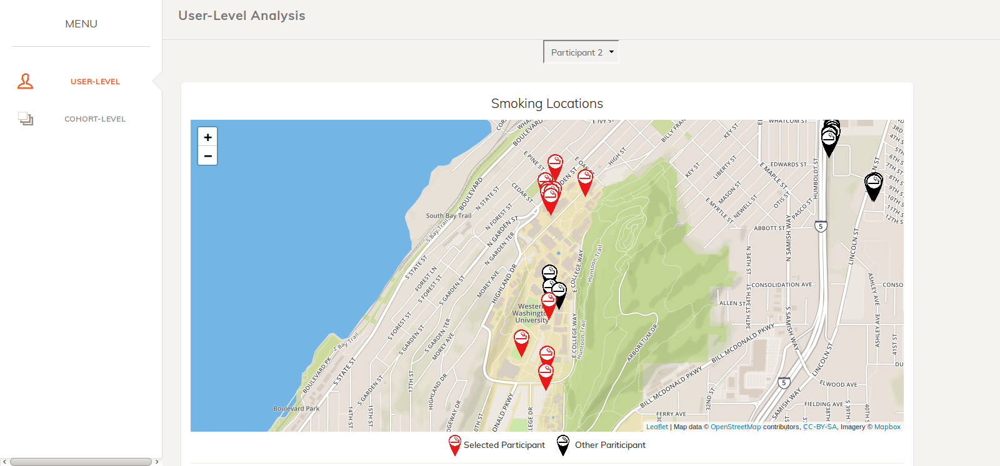
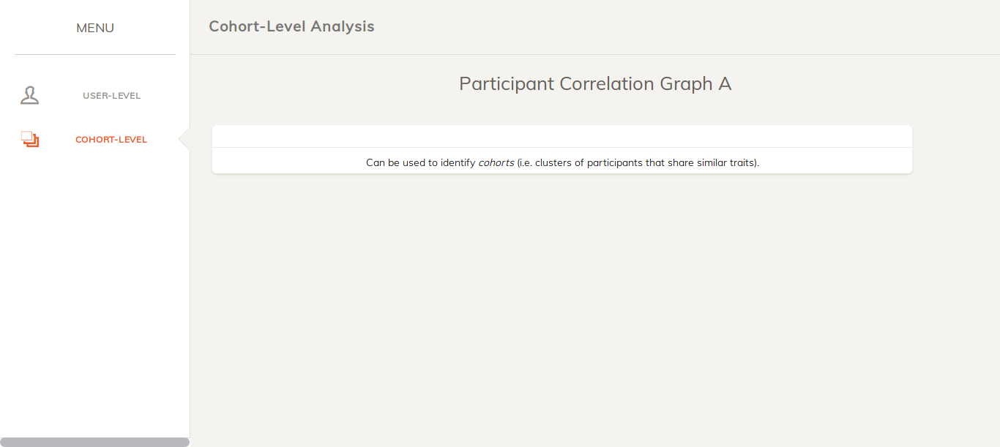

# smoking-viz

CSCI 4/597 Smoking Cessation Data Visualization Project

This is a web-based tool that can be used by health researchers to analyze the
behavior of regular smokers in the field. 



## Setup
1. This tool relies on qualitative and quantitative data collected from mobile and 
wearable devices in the field. For this data to be used in our tool we rely on 
various preprocessing scripts to generate static files containing user data. In
future we hope build a more robust ETL to populate our application in near
real-time. So, to use our application now, you must be provided with a set of
pregenerated static files (see ```node-app/data/README.md```).

2. This is a web-based application that runs on a local server using Node.js. To
install ```node``` and ```npm```, see:
[https://www.npmjs.com/get-npm](https://www.npmjs.com/get-npm)

3. Once node and npm are installed, navigate to the directory ```node-app``` and
run the following commands:

```
npm install   # Installs all JavaScript packages used in our project
npm run build # Builds the project
npm start     # Starts the local node server
```

Finally, open a web browser and navigate to [localhost:4800/](localhost:4800/) 

## Tools Used
* JavaScript libraries (for details see ```node-app/package.json```): D3.js, Node.js, Webpack.js, Leaflet.js, jStat.js, Babel.js
* D3 plugins: [d3-sankey](https://github.com/d3/d3-sankey), [correlation-graph](https://github.com/micahstubbs/correlation-graph)
* Python Packages: Pandas, NumPy, SciPy
* HTML/CSS template: [https://www.creative-tim.com/product/paper-dashboard](https://www.creative-tim.com/product/paper-dashboard)
* Tutorial followed to build the webpack dev environment: [http://willamesoares.com/tech/setting-up-d3js-with-babel-and-webpack/](http://willamesoares.com/tech/setting-up-d3js-with-babel-and-webpack/)

Troubleshooting:

If you see this:



Then you do not have the static files containing user data in
```node-app/data```. When you gain access to these files, see: ```node-app/data/README.md```.
